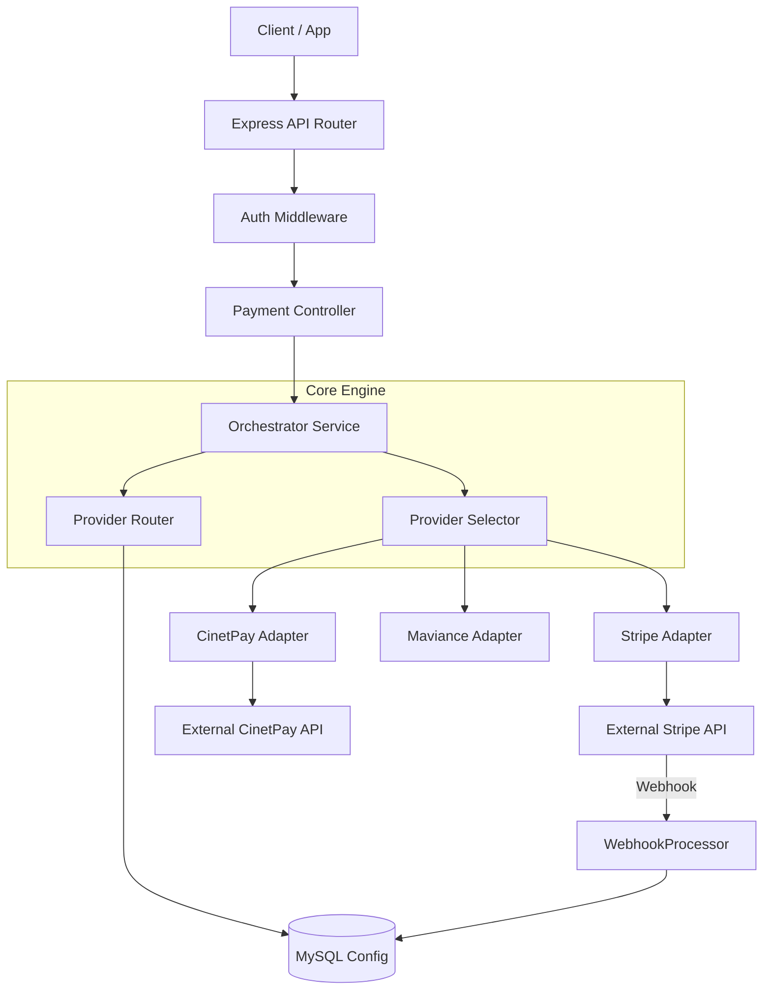

# 🏗️ Architecture Guide - Studies Payment Engine

This document details the internal design, software patterns, and logic flows of the Studies Payment Aggregator.

## 🌟 Design Philosophy

The system is built to be **Resilient**, **Agnostic**, and **Traceable**.

- **Resilient**: Automatic fallback to secondary providers upon primary failure.
- **Agnostic**: Core logic is independent of specific gateway requirements (Stripe, CinetPay, etc.).
- **Traceable**: Every webhook, event, and attempt is logged in the database for audit.

---

## 🗺️ High-Level System Map

---

## 🛠️ Design Patterns

### 1. Adapter Pattern (Interface-based)

We use a common interface `PaymentProviderInterface` to ensure that every new provider added to the system speaks the same language as our core engine.

- **Goal**: Uniformity in `createPayment`, `checkStatus`, and `validateWebhook`.

### 2. Strategy Pattern (Routing)

The `ProviderRouterService` uses strategies to filter available "Provider Routes" based on the context:

- `Strategy A`: Match Country + Currency.
- `Strategy B`: Match Payment Method compatibility.
- `Strategy C`: Sort by Priority (Defined in DB).

### 3. Factory Pattern (Instanciation)

The `ProviderFactory` is responsible for loading the correct service class dynamically based on the provider code (e.g., `'STRIPE'` -> `StripeService`).

---

## 📈 The Payment Lifecycle

### Phase 1: Initiation

1. **Validation**: Input is validated via Zod.
2. **Persistence**: An `Order` and a `PaymentIntent` are created.
3. **Selection**: The Router finds the 1st prioritized provider for Africa/MobileMoney.

### Phase 2: Execution & Failover

The `ProviderSelectorService` executes the payment with a **Fallback Loop**:

- If `Stripe` fails (HTTP 500 or downtime), the error is caught.
- The Selector records the failure in `PaymentAttempt`.
- It immediately picks the 2nd provider (e.g., `CinetPay`) and retries.
- The client receives the `redirectUrl` of the successful provider.

### Phase 3: Completion (Async)

1. **Webhook**: The gateway sends a POST request.
2. **Verification**: `WebhookProcessor` validates the signature.
3. **Finalization**: `PaymentIntent` is marked `SUCCEEDED`.
4. **Trigger**: System sends the professional PDF Invoice to the client.

---

## 💾 Data Modeling Logic

| Model | Logic |
|-------|-------|
| `Order` | The business stable truth (Amount, Client). |
| `PaymentIntent` | The current session/intention (Idempotency Key). |
| `PaymentAttempt` | The transient technical try (Transaction ID, Provider). |
| `ProviderRoute` | The configuration layer (Priority, Region). |

---

## 🚀 Scalability Considerations

- **Statelessness**: The backend is completely stateless, allowing horizontal scaling via Docker/K8s.
- **Database Indexing**: Critical fields (`transactionNumber`, `reference`, `idempotencyKey`) are indexed to maintain 200ms query times even with millions of records.
- **Service Isolation**: Each provider adapter is isolated. A bug in the CinetPay code cannot break the Stripe flow.
